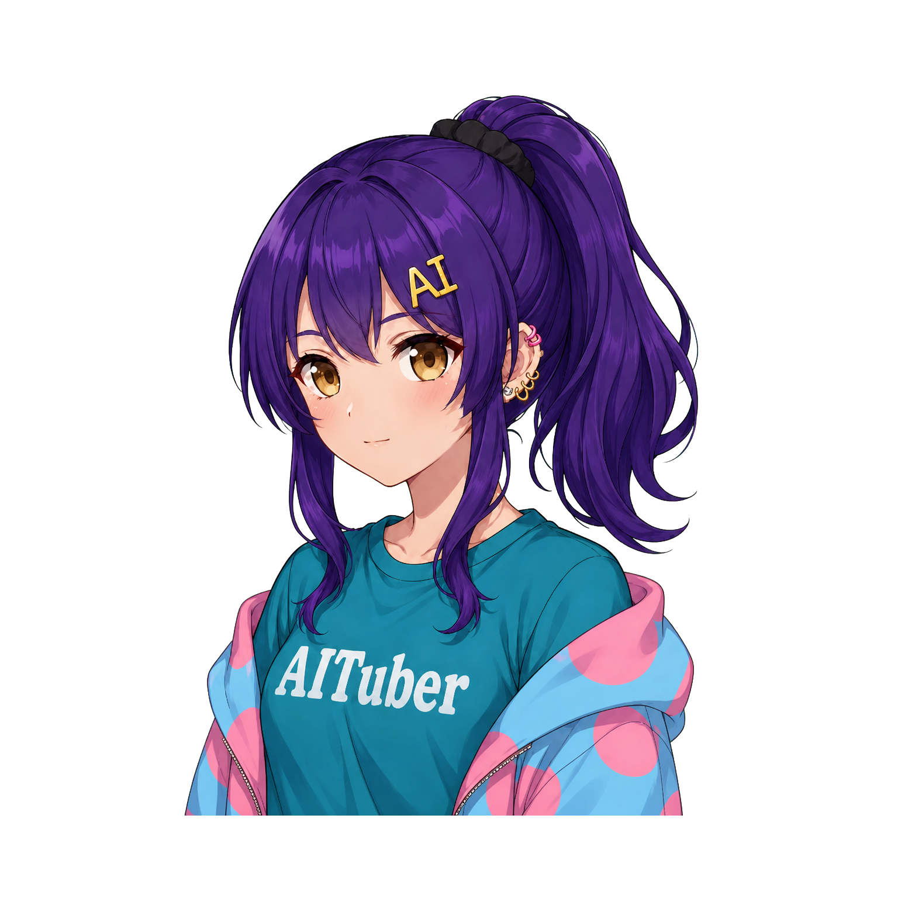

<p align="center">
  
</p>

<h1 align="center">CharaDock</h1>

<p align="center"><strong>キャラクターに、居場所と鼓動を。</strong></p>
<p align="center">話して、覚えて、一緒に作業する。透過キャラクターとCodexをつないだWindowsデスクトップコンパニオン。</p>

<p align="center">
  <a href="./README.md">English</a>
</p>

<p align="center">
  
  
  
  
</p>

<p align="center">
  <a href="#クイックスタート">クイックスタート</a> ·
  <a href="#できること">できること</a> ·
  <a href="#一枚絵からキャラクターを追加">Avatar Studio</a> ·
  <a href="./DESKTOP_APP.md">デスクトップ版ガイド</a> ·
  <a href="./docs/usage.md">ブラウザー版ガイド</a>
</p>

<p align="center">
  
</p>

CharaDockは、[rotejin/PuruPuruPNGTuber](https://github.com/rotejin/PuruPuruPNGTuber)を基にした非公式派生アプリです。キャラクターが呼吸し、視線を動かし、声で会話し、必要なら選択したフォルダーの中でCodexと作業します。入力欄や履歴は必要なときだけ現れ、普段はデスクトップの片隅で静かに過ごします。

> [!IMPORTANT]
> 現在はプレリリースです。コードはApache-2.0ですが、画像には別の利用条件があります。公開・フォーク・配布前に[ライセンスと素材](#ライセンスと素材)を確認してください。

## できること

| 話す | 作業する | 自分のキャラを作る |
| --- | --- | --- |
| 顔の近くへ返答をストリーミング。音声入力、読み上げ、表情、リップシンクをキャラごとに設定できます。 | 小さなUIから`会話 / 作業`を切替。選択した1フォルダーだけでCodexが作業し、進行と結果を履歴へ残します。 | `Codex Avatar Studio`が一枚絵から目・口・表情差分、髪レイヤー、初期リグ、性格を生成・検証します。 |

### デスクトップに馴染む動き

- 透明・最前面のフレームレス表示
- 呼吸、まばたき、髪揺れ、静かな待機視線、実音声波形による3段階リップシンク
- キャラクター上にカーソルがある間だけ有効なマウス追従
- モニター端への吸着、位置ロック、マルチモニター対応
- サイズ、可動範囲、追従速度、揺れ、性格、話し方、吹き出し位置をキャラごとに保存
- OSのライト／ダーク、高コントラスト、視差・透明効果の設定へ追従

### 会話を続けられる

- Codex app-serverのChatGPTログイン、またはOpenAI Responses API
- 現在読み上げている文を吹き出しへ表示し、完了後は全文へ戻る長文表示
- 会話履歴と作業履歴をアプリ終了後も復元
- キャラクターごとに最大20往復の会話履歴を保持
- 呼び名、好み、関係性、継続目標を自動抽出するキャラクター別の長期メモリ
- 長期メモリは端末内に最大24件。内容の確認、個別削除、一括削除が可能
- キャラごとの永続的なキャラクターホームと、元ファイルを移動せず切り替えられる既存プロジェクト参照
- テキスト、画像、音声、動画、PDF、フォルダー、静的Web成果物をアプリ内で確認できる成果物カード
- Next.js、Vite、Nuxt、Astro、SvelteKitなどを、開発サーバーの状態・ログと一緒に確認できるライブプレビュー

一時的な依頼、推測、外部サイトの内容、秘密情報、住所・連絡先・センシティブな属性は長期メモリへ保存しません。メモリはキャラクター間で共有されません。

### CharaDock Link — リモートアクセス（実験的）

設定から明示的に有効化すると、同じプライベートWi-Fiにあるスマートフォンなどへキャラ中心の画面を表示できます。短時間だけ有効なQRコードで端末ごとにペアリングすると、CharaDock側で解除するまでは再スキャンなしで再接続できます。文字によるChat、個別に許可したWork、経過時間付きの進捗タイムライン、現在の応答を安全に中断して送るフォローアップ、全画面履歴、成果物カードを利用できます。キャラクター、準備済みの通常TTS方式、方式ごとの音声モデルをリモート画面から切り替え、モデルはキャラクターごとに保存されます。PCとスマートフォンの再生も個別にON / OFFできます。GPT-Liveはスマートフォンから開始・停止でき、回答音声と字幕もスマートフォンへ直接届きます。HTTPSで開いた場合はスマートフォンのマイクをそのままLive入力に利用できます。スマートフォン直結LiveではBeatrice 2を経由せず、選択したGPT-Live音声を再生します。

確認済みのTailscale HTTPS接続では、画面撮影、ブラウザ操作、前面のコンピューター操作を、期限付きの承認カードとしてスマートフォンへ表示して回答できます。同じ安全な経路からCharaDock Linkをホーム画面PWAとして追加し、Work・Live中の画面点灯や、Linkがバックグラウンドで動作している間の完了・承認待ち通知を任意で有効化できます。Tailscale Serveが有効な間は、ペアリングQRコードとコピーURLもローカルIPから確認済みのHTTPS接続先へ自動的に切り替わります。通常LANのHTTP接続から機密性の高い承認へ回答することはできません。

ペアリングURLは最初の端末が使用するか10分経過すると無効になります。ペアリング済み端末の信頼情報はPCへ安全なハッシュとして保存され、短い操作セッションが切れても自動で再接続します。端末の信頼期限は180日で、PC側から端末ごとまたは一括でいつでも解除できます。Cookie削除、信頼期限切れ、解除後は再ペアリングが必要です。

通常のローカルLAN経路はHTTPのままなので文字操作用です。ブラウザのマイクAPIにはHTTPSが必要なため、音声入力や外出先からの利用には、任意で[Tailscale Serve](https://tailscale.com/docs/features/tailscale-serve)を利用できます。設定画面からローカル待受ポートとTailscale HTTPSポートを選び、状態確認、開始、停止まで行えます。CharaDockは既存のServe設定を検出した場合は上書きせず、CharaDock自身が開始した設定だけを停止します。Tailscaleは必須ではなく、ルーターのポート開放や公開用のTailscale Funnelは使用しないでください。

### ESP32音声デバイス

別リポジトリの [CharaDock-ESP32](https://github.com/ochisamu/CharaDock-ESP32) は、M5Stack ATOM Voice（旧製品名 ATOM Echo）を小型の無線音声デバイスとして使うファームウェアを提供します。USB経由で一度Wi-Fi設定を行うと、ボタンまたはハンズフリーで話し、通常TTS、GPT-Live、Beatrice 2の音声を内蔵スピーカーで再生できます。Chat／Work、キャラクター、声、作業フォルダーはPC版の設定を引き継ぎます。

> **対応製品名について:** 商品コード `M5STACK-C008-C` は、2026年4月に販売名が「ATOM Echo」から「ATOM Voice」へ変更されました。同じ旧ESP32-PICO-D4搭載製品です。購入・仕様確認は [スイッチサイエンスのATOM Voice商品ページ](https://www.switch-science.com/products/6347) を参照してください。CharaDock v0.5.0の設定画面とファームウェア名では互換性のため「ATOM Echo」表記を使用しています。

設定には独立した **ESP32デバイス** ページがあり、全体ゲイン、リアルタイムのマイクレベルと開始閾値、デバイスのLive接続だけを最後の会話から5分で終了する任意設定を用意しています。自動終了は初期状態OFFです。機種固有の設定を分離し、将来のハードウェアをATOM Echoの設定へ混在させず追加できる構成です。

通信は信頼できるプライベートLAN向けで、設定時に生成したランダムなペアリング鍵によりデバイスを認証します。ルーターのポートを公開せず、OpenAI認証情報をファームウェアへ保存しません。動作とトラブルシューティングは [ATOM Echoガイド](./docs/atom-echo-mvp.md) を参照してください。

### 声を選べる

音声入力方式は設定で明示的に選びます。Codex Realtimeを自動起動したり、失敗時に別方式へ勝手に切り替えたりしません。

- **入力:** Codex Realtime、ローカルsherpa-onnx、端末音声認識、OpenAI文字起こし
- **ローカル認識:** 日本語Parakeet CTC、ReazonSpeech Zipformer、SenseVoice、Whisper base / tiny
- **VAD:** Silero VADによる無音区切り、自動送信、3段階の感度
- **出力:** Windows標準音声、Style-Bert-VITS2、piper-plus、Supertonic 3、Kokoro、Irodori TTS
- **Realtime:** キャラクターごとにLive音声を選択。録音ボタンを押した間だけ接続し、文字入力にも同じLive音声で応答。Windowsでは、別途導入したBeatrice 2 VST3へ48 kHz音声を流し、複数の参照モデルと声・ピッチ・フォルマント・音量・イントネーション・ピッチ補正をキャラクターごとに設定可能
- **読み上げ整形:** URL、メール、パス、コード、長いハッシュ、Markdown記号を除外。ユーザー辞書と英字語の日本語読みへ対応

<details>
<summary><strong>ローカル音声モデルについて</strong></summary>

モデルは必要なものだけ設定画面からダウンロードし、SHA-256検証後に選択します。音声方式と声はキャラクターごとに保存されます。

- **piper-plus:** 公式C++ランタイムと「つくよみちゃん」FP16モデル、または手動指定の専用ONNX
- **Supertonic 3:** 同梱sherpa-onnxによるCPU推論。F1–F5 / M1–M5、速度、生成ステップを選択
- **Kokoro:** 日本語5音声。WebGPUを優先し、無音・非有限値を検出した場合はCPUで再生成
- **Irodori TTS:** v4 Small（推奨）と、従来の500M-v3 WebGPU Voice Cloneモデルをキャラごとに選択できます。v4 Smallは高品質なFP16（約1.7GB）と、公式INT4チェックポイントを起点にWebGPU向けW4A16へ変換した軽量版（約853MB）を切り替えられます。captionによるVoice Designと最大120秒の許諾済み参照音声に対応し、基本captionへ発話単位の感情を3段階の強さで追加のAI推論なしに反映します。500M-v3は既存の参照音声設定を維持し、最大60秒の参照音声を利用できます。WAV / MP3 / M4A / AAC / OGG / FLAC / WebMは48kHz WAVへ変換してアプリ管理領域へ保存します。各モデルをアプリ内でダウンロード・SHA-256検証でき、手動選択にも対応します。モデル本体はCharaDockへ同梱しません

長文は句点や自然な区切りで分割し、現在の区間を再生しながら次の区間を合成します。Style-Bert-VITS2はローカルAPIのURL、モデルID、速度を指定できます。
</details>

## 収録キャラクター

デスクトップ配布物には5キャラクターを収録します。

| コハク | セピア | トワ | セージ | AIニケちゃん |
|:---:|:---:|:---:|:---:|:---:|
|  |  |  |  |  |
| 快活で素直。前向きに背中を押す。 | 余裕と洞察があり、頼れる。 | 機転が利き、発見を一緒に試す。 | 穏やかな知性派。複雑なことを整理する。 | AIキャラクターの調査・創作と実践をつなぐ。 |

コハク、セピア、トワ、セージは通常の目・口差分に加え、嬉しい・驚き・やさしい表情差分を持ちます。AIニケちゃんは許諾済みキャラクター素材を元に、目の開閉と口3段階の差分を収録しています。選択キャラに合わせて設定画面とコンパニオンUIのアクセントも変化します。

AIニケちゃんは許可を受けて収録しています。クレジット: [tegnike](https://x.com/tegnike) · [AIニケちゃん公式サイト](https://nikechan.com/)。キャラクター素材はApache-2.0の対象外です。詳細は[アセット通知](./assets/nike-avatar/ASSET_NOTICE.md)をご確認ください。

## クイックスタート

### Windows — リリース版をダウンロード

[GitHub Releases](https://github.com/ochisamu/CharaDock/releases)から最新版のインストーラーまたはポータブル版をダウンロードできます。

- **インストーラー版:** `CharaDock.Setup.*.exe`をダウンロードしてセットアップを実行
- **ポータブル版:** `CharaDock.*.exe`をダウンロードし、任意のフォルダーから直接起動

現在のプレリリース版はコード署名されていないため、Windows SmartScreenの警告が表示される場合があります。アプリは起動時にGitHub Releasesを確認し、インストーラー版・ポータブル版それぞれに合った最新版への更新方法を案内します。

### ソースから起動する場合の必要環境

- Windows 10 / 11 x64
- Node.js 22以降（Node.js 24推奨）
- Codex機能を使う場合は、ログイン可能な[Codex CLI](https://github.com/openai/codex)
- Python検査を行う場合のみPython 3.11と[uv](https://docs.astral.sh/uv/)

### 開発版を起動

```bash
npm ci
npm run desktop
```

WSLからWindows固有の表示、音声、WebGPUを確認するときは、配布用EXEを作らずWindows Electronを直接起動できます。

```bash
npm run desktop:win:dev
```

初回または依存関係の変更時だけWindows用`npm ci`を実行し、以後は`%LOCALAPPDATA%\CharaDockDev\source`への差分同期だけで起動します。設定とダウンロード済みモデルは専用の`CharaDockDev`プロファイルへ保持されます。通常版の設定・モデルを使う必要がある場合のみ、通常版を終了してから`npm run desktop:win:dev:profile`を使用してください。開発コードが通常版の設定を更新する可能性があるため、常用は非推奨です。

### macOS — 実験的なソース起動

現時点では署名済みmacOSアプリ、DMG、ZIPを配布していません。macOSで試す場合はNode.js 24を用意し、リポジトリをcloneしてElectron開発版を起動してください。

```bash
git clone https://github.com/ochisamu/CharaDock.git
cd CharaDock
npm ci
npm run desktop
```

macOS対応は未署名・実験用のarm64プレビューで、Windows版のリリーステスト対象外です。GitHub ReleaseからmacOS用DMGまたはZIPを取得してください。アプリにはBeatriceネイティブホストを同梱しているため、ホストの手動配置は不要です。macOSのコンピューター操作は、利用可能な場合にCodex同梱の公式Computer Useスキルへ委譲します。Windows標準音声は利用できません。そのほかのローカル音声やWebGPU機能もMacの機種・OSバージョンによって動作が異なる可能性があります。ソース起動版は最新版を確認できますが、自動的な本体更新は行いません。

初回ウィザードでAI接続、キャラクター、音声出力を設定します。Windows Store版Codexも自動検出します。`codex`が`PATH`にない場合は`CODEX_CLI_PATH`で実行ファイルを指定できます。

1. キャラクター右下の`✦`へマウスを重ね、入力欄を開きます。
2. そのまま会話するか、左端の`会話`を押して`作業`へ切り替えます。
3. Workの初回だけ、作業を許可するフォルダーを選びます。
4. `履歴`から過去の会話、指示、操作、結果を確認できます。

| 操作 | キー |
| --- | --- |
| 現在のモードの入力欄を開く | `Ctrl + Shift + Enter` |
| 設定を開く | `Ctrl + Shift + M` |
| クリック透過 | `Ctrl + Shift + L` |
| キャラクター表示 | `Ctrl + Shift + H` |

## 安全な作業と画面操作

- Chatはread-only
- Workは現在のホーム／担当プロジェクトと、選択中キャラの管理ホームだけをworkspace-write
- 担当プロジェクトは元の場所に残り、切り替えや解除をしても元ファイルを削除しない
- 静的Web成果物はネットワーク通信を無効化したサンドボックス内でプレビュー
- 動的Webプレビューは、同時に1つのローカル開発サーバーだけを起動。`dev`、`preview`、`start`のうち実行するpackage scriptを事前に表示して確認し、依存関係を勝手にインストールしない
- 開発サーバーは`127.0.0.1`だけで待ち受け、プロジェクト切替時とアプリ終了時に停止。表示ログは件数を制限し、保存しない。プレビューしたアプリ自身の外部通信は、そのプロジェクトの実装に従う
- 会話と作業は別スレッド・別権限。モデルとreasoning effortもそれぞれ設定可能
- 実行中ターンは履歴パネルから中断可能
- 画面撮影、専用ブラウザー、コンピューター操作は会話の中で許可を確認
- 許可後5分以内の「続けて」「そのまま」など、同じ操作の明確な続きだけ再確認なしで利用
- 別サイト、別目的、終了表現、5分経過、専用ブラウザーを閉じた場合は許可を失効
- 削除、送信、購入、インストール、認証・支払い設定、秘密情報の入力は自動操作しない
- 一時スクリーンショットは回答後に削除

ブラウザー操作は可視の専用ウィンドウで行い、ページ閲覧、リンク移動、クリック、検索文字入力、選択、キー、スクロール、戻るに対応します。許可中は通常のWeb検索を無効化し、専用ブラウザーを使わなかった回答を停止します。コンピューター操作は画面を毎回確認しながら、1ターン最大30操作まで実行します。

## AI接続とプライバシー

ローカル保存、外部AI・音声サービス、端末権限、リモート接続、保存期間、削除手段の詳細は[CharaDockプライバシーポリシー](https://ochisamu.github.io/CharaDock/privacy.html)をご確認ください。

### Codex app-server

アプリはローカルの`codex app-server --stdio`を起動します。ChatGPTの認証トークンはCodexが管理し、CharaDockは受け取りません。app-serverから取得したモデル一覧をプルダウン表示し、会話と作業で別々にモデルとreasoning effortを設定できます。

GPT-Live / Codex Voiceは実験機能です。利用可否はアカウントや上流実装に依存します。Realtimeセッションは新しい空のタスクとして、録音ボタンを押したときだけ開始します。Workでは選択フォルダー限定のworkspace-writeスレッドへ接続し、音声で依頼した作業も履歴へ残します。

CharaDockのBeatrice 2声変換連携は、Windowsでは`charadock-beatrice-host.exe`、macOSでは実験用アプリに同梱した拡張子なしのarm64ヘルパーという独自の小さなネイティブVST3ホストを利用します。CharaDockはBeatrice本体・推論ライブラリ・音声モデルを再配布しません。音声設定から別途展開した公式Beatriceフォルダーを選び、参照モデル一覧へモデルフォルダーを追加してください。CharaDockは外部モデルをコピー・削除しません。モデルごとの利用条件は別途確認が必要で、Beatrice 2.0.0-rc.2付属のJVSモデルは許可のない営利利用を禁止しています。ソースからホストを作る場合は[ネイティブホストのビルドガイド](./native/beatrice-host/README.md)を参照してください。

### OpenAI APIとローカル処理

Responses APIによる会話とTranscriptions APIによる文字起こしを利用できます。APIキーはレンダラーへ渡さず、利用可能な場合はOSの暗号化ストレージへ保存します。sherpa-onnx、端末音声認識、通常の口パク、対応TTSは端末内で処理します。Codex RealtimeまたはOpenAI文字起こしを選んだ場合のみ、音声が該当サービスへ送られます。

## 一枚絵からキャラクターを追加

Codex app-server接続時は、設定の`Codex Avatar Studio`からPNG・JPEG・WebPを選べます。同梱の[`.agents/skills/build-purupuru-avatar/`](./.agents/skills/build-purupuru-avatar/)を隔離されたworkspace-writeジョブで実行し、次を独立に品質検証してから追加します。

- 目2段階 × 口3段階の標準PNG差分
- 嬉しい・驚き・やさしい表情差分
- 可動する前髪と後ろ髪レイヤー
- 初期リグ、表示サイズ、可動範囲
- 任意指定または自動提案の性格、話し方、触れ合い文

利用者は、アップロード・加工・利用に必要な権利を持つ画像だけを使用してください。

既存の`.purupuru`もキャラクター設定から追加・削除できます。調整したキャラクターは、画像込みのポータブルな `.purupuru` アバターパッケージとして保存できます。元のPNG素材フォルダに依存しないため、バックアップや別PCへの移行に利用できます。

## WindowsバイナリとGitHub Pages

通常のWindows利用者は[GitHub Releases](https://github.com/ochisamu/CharaDock/releases)からインストーラー版またはポータブル版をダウンロードしてください。以下はメンテナーがローカルで配布物を生成する場合の手順です。

ローカルでNSISインストーラーとportable版を生成します。

```bash
npm run dist:win:installer
```

[`Windows package`](./.github/workflows/release.yml)はWindowsランナーで同じビルドを行います。手動実行では14日間保持する成果物を生成し、`v0.1.0`のようなタグでは`.exe` 2種と`SHA256SUMS.txt`をDraft Releaseへ添付します。現在の開発ビルドはコード署名されていません。

ランディングページは[`site/`](./site/)にあります。`npm run site:build`で`site-dist/`へ生成し、[`GitHub Pages`](./.github/workflows/pages.yml)が`main`更新時に公開用成果物を組み立てます。

## ブラウザー版PuruPuruエディター

元のPuruPuru編集画面とOBS向け透過表示も残しています。

```bash
uv run python scripts/run_local_server.py
```

表示された`http://127.0.0.1:8223/`をChromeまたはChromiumで開きます。素材形式、OBS、調整方法は[docs/usage.md](./docs/usage.md)を参照してください。

## 開発とテスト

```bash
npm test
npm run site:build
```

| パス | 内容 |
| --- | --- |
| `desktop/` | Electronメインプロセス、preload、設定・会話UI |
| `assets/` | キャラクター画像とPuruPuru設定 |
| `.agents/skills/` | 一枚絵からキャラクターを追加するCodex Skill |
| `site/` | GitHub Pages用ランディングページ |
| `vendor/mediapipe/` | オフライン顔追従に必要なMediaPipe、WASM、モデル |
| `scripts/` | ローカルサーバー、サイト生成、検証補助 |
| `tests/` | Node / JavaScript / Pythonテスト |

`vendor/`に残すのは、`npm install`では復元できないMediaPipeランタイムとモデルだけです。更新方法は[docs/vendor-update.md](./docs/vendor-update.md)を参照してください。

## ライセンスと素材

- ソフトウェアコードとドキュメント: [Apache License 2.0](./LICENSE)
- 元プロジェクトと変更点: [NOTICE](./NOTICE)、[MODIFICATIONS.md](./MODIFICATIONS.md)
- 第三者依存関係: [THIRD_PARTY_NOTICES.md](./THIRD_PARTY_NOTICES.md)
- 同梱Irodori参照音声: `hiro.wav`はochisamu本人の録音・許諾音声、`kohaku.wav`は[あみたろの声素材工房](https://amitaro.net/)の音声素材を[現行の利用規約](https://amitaro.net/voice/voice_rule/)に基づいて使用
- プロジェクトオリジナルのデスクトップ版4キャラクターとCharaDockアイコン: [DISTRIBUTION_ASSET_LICENSE.md](./DISTRIBUTION_ASSET_LICENSE.md)
- AIニケちゃん: 許可を受けて収録。クレジットは[tegnike](https://x.com/tegnike)および[公式サイト](https://nikechan.com/)。詳細は[assets/nike-avatar/ASSET_NOTICE.md](./assets/nike-avatar/ASSET_NOTICE.md)
- 元ブラウザー版に残る上流サンプル素材: [ASSET_LICENSE.md](./ASSET_LICENSE.md)

デスクトップ配布物には上流の旧デモキャラクターと旧faviconを含めません。ソースツリーに残る上流サンプルは、ブラウザー編集画面の互換性・検証用であり、Apache-2.0の対象ではありません。

### 組み込みビジュアル素材の来歴

コハク、セピア、トワ、セージの元絵と生成差分は、このプロジェクトのためにOpenAI `gpt-image-2`で作成したもので、上流リポジトリの旧デモキャラクターではありません。CharaDockアイコンもOpenAIの画像生成で作成し、マルチ解像度のアプリアセットとしてローカルで仕上げています。[OpenAI利用規約](https://openai.com/policies/terms-of-use/)では、OpenAIと作成者との関係において、適用法で認められる範囲で作成者が生成Outputを所有するとされています。一方で、生成Outputは一意とは限らず、独立して存在する第三者の権利まで放棄・保証するものではありません。配布時の利用条件は[DISTRIBUTION_ASSET_LICENSE.md](./DISTRIBUTION_ASSET_LICENSE.md)に記録しています。

AIニケちゃんは上記のプロジェクトオリジナル素材とは別の許諾キャラクターです。CharaDock profileに保存されていたキャラクターデータを元にした目・口差分を、tegnikeさんの許可を受けて収録しています。この許可から、素材単体の再利用に関する広いライセンスが付与されるものではありません。

## コントリビューション

- [GitHub SponsorsでCharaDockの開発を支援](https://github.com/sponsors/ochisamu)
- [Contributing](./.github/CONTRIBUTING.md)
- [Security policy](./.github/SECURITY.md)
- [Support](./.github/SUPPORT.md)
- [GitHub公開チェックリスト](./docs/github-release-checklist.md)

CharaDock is not endorsed by or affiliated with the original PuruPuru PNGTuber developer.
